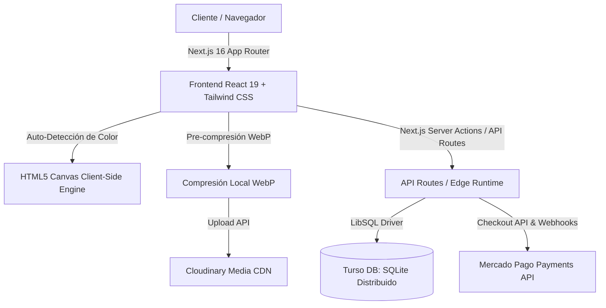

# 🏛️ BLUEPRINT ARQUITECTÓNICO MAESTRO - KÜYEN E-COMMERCE

> **Versión del Sistema:** 2.4.0  
> **Última Actualización:** Agosto 2026  
> **Estado:** Producción / Alta Disponibilidad  
> **Propósito:** Documento de diseño técnico y referencia arquitectónica integral de la plataforma KÜYEN.

---

## 1. 🌟 Visión General y Objetivos del Sistema

KÜYEN es una plataforma de comercio electrónico de alta costura y vestidos exclusivos diseñada bajo los principios de **velocidad extrema (Edge-First), estética inmersiva (Boutique Dark) y resiliencia transaccional**.

### Pilares Arquitectónicos:
1. **Cero Latencia en Catálogo:** Páginas prerenderizadas y optimizadas con Next.js Turbopack y SQLite distribuido en el Edge (Turso DB).
2. **Subida y Optimización Autónoma de Activos:** Pre-compresión WebP en el navegador y CDN Cloudinary con nombres semánticos SEO.
3. **Persistencia Atómica Relacional:** Matriz de variantes ($Talla \times Color$) con stock granular y consistencia referencial.
4. **Marketing y Crecimiento:** Módulo nativo de Cupones de Descuento y Tracking de Afiliadas/Embajadoras.
5. **Seguridad y Anti-Fraude:** Validación de precios en el servidor, autenticación JWT Web Crypto en cookies `httpOnly`, CSP estricto y rate limiting.

---

## 2. 🚀 Stack Tecnológico

| Capa | Tecnología | Rol y Características |
| :--- | :--- | :--- |
| **Framework Base** | Next.js 16.0.9 (App Router) + Turbopack | Renderizado híbrido (SSR, ISR, Server Components, Route Handlers) |
| **Biblioteca UI** | React 19 + TypeScript 5.9 | Componentes desacoplados con tipado estricto |
| **Estilos & Animaciones** | Tailwind CSS + Framer Motion + Lucide React | Diseño "Boutique Dark", transiciones suaves y microinteracciones |
| **Motor de Base de Datos** | Turso DB (`@libsql/client`) | SQLite relacional descentralizado en AWS us-east-1 con replicación |
| **Almacenamiento Multimedia** | Cloudinary REST API | Hospedaje y entrega de imágenes WebP en alta resolución |
| **Procesamiento de Pagos** | Mercado Pago SDK (`mercadopago`) | Creación de preferencias atómicas y Webhook con verificación de firmas |
| **Seguridad & Auth** | Web Crypto API (JWT HMAC-SHA256) | Autenticación administrativa sin dependencias externas pesadas |
| **Testing & Calidad** | Vitest + JSDOM + Testing Library | Suite de 26+ pruebas unitarias automatizadas |

---

## 3. 🗄️ Esquema Relacional de Base de Datos (Turso DB)

La base de datos relacional cuenta con 9 tablas optimizadas con claves foráneas lógicas e índices:

```mermaid
erDiagram
    CATEGORIES ||--o{ PRODUCTS : "clasifica"
    PRODUCTS ||--o{ PRODUCT_IMAGES : "contiene"
    PRODUCTS ||--o{ PRODUCT_VARIANTS : "posee"
    SIZES ||--o{ PRODUCT_VARIANTS : "define talla"
    COLORS ||--o{ PRODUCT_VARIANTS : "define color"
    COUPONS ||--o{ ORDERS : "aplica descuento"

    CATEGORIES {
        string id PK
        string name
        string slug
        string description
    }

    PRODUCTS {
        string id PK
        string sku
        string name
        string slug
        string description
        string short_description
        string category_id FK
        float price
        float original_price
        int featured
        int is_active
        float rating
        int reviews_count
        string created_at
        string updated_at
    }

    PRODUCT_IMAGES {
        string id PK
        string product_id FK
        string url
        string alt_text
        int is_primary
        int display_order
        string created_at
    }

    SIZES {
        string id PK
        string name
        int display_order
        float bust_cm
        float waist_cm
        float hips_cm
        int is_plus_size
    }

    COLORS {
        string id PK
        string name
        string hex_code
        int display_order
    }

    PRODUCT_VARIANTS {
        string id PK
        string product_id FK
        string size_id FK
        string color_id FK
        string sku_variant
        int stock_quantity
        int is_available
        string created_at
        string updated_at
    }

    COUPONS {
        string code PK
        string discount_type
        float discount_value
        float min_cart_amount
        int usage_limit
        int usage_count
        string expires_at
        int is_active
        string affiliate_name
        string created_at
    }

    ORDERS {
        string id PK
        string order_number
        string status
        string payment_status
        string payment_id
        float total
        string coupon_code FK
        float discount_applied
        string shipping_address
        string items
        string created_at
        string updated_at
    }

    SUBSCRIBERS {
        string id PK
        string email
        string created_at
    }
```

---

## 4. 🧠 Flujos de Datos Principales

### 4.1. Creación y Edición de Vestidos con Auto-Detección de Colores
1. **Admin carga fotos:** El usuario arrastra 1 a 8 imágenes a `MultiImageUpload`.
2. **Auto-Detección Inteligente:**
   - La primera imagen se dibuja en un canvas virtual de $100 \times 100$ píxeles.
   - Se ignora el fondo claro/transparente.
   - El algoritmo de distancia euclidiana RGB calcula los colores dominantes y activa automáticamente los botones de la paleta (*Borgoña, Negro, etc.*).
3. **Pre-Compresión & CDN:** Las imágenes se convierten a WebP con calidad 0.8 en el cliente y se suben a Cloudinary con nombres SEO (`vestido-gala-1234-1.webp`).
4. **Persistencia Atómica:** `POST /api/products` invoca `syncProductVariants(...)` en `lib/db/products.ts`:
   - Resuelve/Crea `sizes` y `colors`.
   - Reemplaza `product_variants` con el producto cartesiano de tallas $\times$ colores elegidos.
   - Almacena las imágenes ordenadas en `product_images`.

### 4.2. Checkout Seguro con Mercado Pago y Cupones
1. **Validación de Cupón:** El usuario ingresa un código en `/checkout`. `POST /api/coupons/validate` verifica vigencia, compra mínima, límite de usos y retorna el descuento calculado.
2. **Creación de Orden en Servidor:**
   - `POST /api/checkout` recibe los ítems y el cupón.
   - **El servidor re-calcula los precios y el descuento desde la base de datos** (ignora precios manipulados por el cliente).
   - Registra la orden con estado `pending`, `coupon_code` y `discount_applied`.
3. **Pasarela de Pago:** Se genera la preferencia en Mercado Pago vinculada al `external_reference = order.id`.
4. **Webhook Asíncrono:**
   - `POST /api/webhook/mercadopago` recibe la notificación del pago.
   - Consulta el estado real a la API oficial de Mercado Pago.
   - Si el pago es `approved`, actualiza la orden a `paid`, incrementa el `usage_count` del cupón e descuenta el stock de las variantes en Turso DB.

---

## 5. 🛡️ Procedimientos y Políticas de Seguridad

1. **Autenticación Administrativa:**
   - Cookie `kuyen_admin_session` con banderas `HttpOnly`, `SameSite=Lax` y `Secure`.
   - Firma criptográfica JWT HMAC-SHA256 con Web Crypto API nativo.
2. **Prevención de Inyecciones SQL:**
   - Todas las consultas a Turso DB son 100% parametrizadas (`turso.execute({ sql: '...', args: [...] })`).
3. **Rate Limiting:**
   - Endpoints públicos sensibles (`/api/checkout`, `/api/coupons/validate`, `/api/auth/login`) cuentan con limitador de tasa en memoria por IP para evitar ataques de fuerza bruta o saturación.
4. **Headers de Seguridad (CSP):**
   - Content-Security-Policy estricto que restringe orígenes de scripts, conexiones e imágenes a dominios autorizados (`res.cloudinary.com`, `api.mercadopago.com`, etc.).

---

## 6. 🧪 Estrategia de Testing y Métricas de Calidad

- **Testing Unitario:** 34 pruebas automáticas en Vitest (`tests/unit/*.test.ts`) cubriendo:
  - Cupones y reglas de descuento porcentual y fijo.
  - Sincronización de variantes y SKU generation.
  - Extracción y matching de color en Canvas.
  - Resolución de slugs semánticos y compatibilidad con UUIDs.
  - Deducción atómica de stock en `products` y `product_variants`.
  - Idempotencia en confirmación de Webhook de Mercado Pago.
  - Generador de comprobantes interactivos de WhatsApp.
  - Tipado de productos y fallback seguro.
- **Validación Continua:**
  - TypeScript: 100% libre de errores (`npm run type-check`).
  - ESLint: 0 errores y 0 warnings (`npm run lint`).
  - Build de Producción: 29 páginas compiladas y sitemap XML autogenerado con slugs (`npm run build`).
